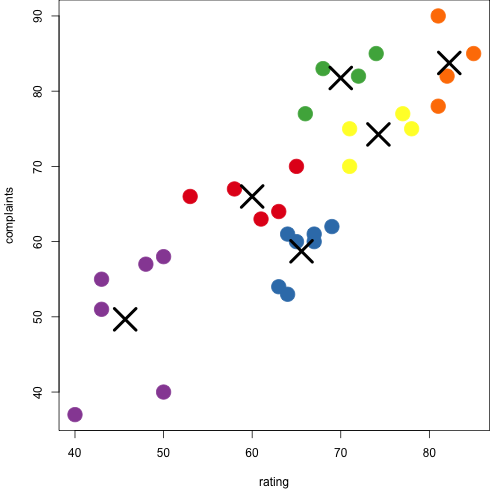

Week 4 Assignment: Using Shiny with the Chatterjee-Price Attitude Dataset
========================================================
author: Sian Lun Lau
date: 13th March 2017
autosize: true

Overview of the assignment
========================================================

A Shiny application was developed to plot k-means clusters for the Chatterjee-Price Attitude Dataset (available in the  library(datasets) package). Users can choose:

- Two variables from the dataset for the intended clustering
- Number of clusters
- The size of the points

ui.R - the sidebarPanel and mainPanel
========================================================


```r
sidebarPanel(
    selectInput('xcol', 'X Variable', names(attitude)),
    selectInput('ycol', 'Y Variable', names(attitude),
                selected=names(attitude)[[2]]),
    sliderInput('clusters', 'Cluster count',
                 min = 1, max = 11, value = 6),
    sliderInput("size", "Size",
                min = 1, max = 5, value = 3
    )
  ),
  mainPanel(
    plotOutput('plot1')
  )
```

server.R - using reactive()
========================================================


```r
  selectedData <- reactive({
    attitude[, c(input$xcol, input$ycol)]
  })
  
  clusters <- reactive({
    kmeans(selectedData(), input$clusters)
  })
```

The shiny application 
========================================================
An example plot if x-axis and y-axis are rating and complaints respectively, and k = 6 and point size is 4.



To view the Shiny app, visit: https://wahlau.shinyapps.io/Week4Assignment/

